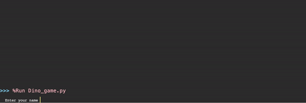

# Dino-game
 - Prototype still under development
# Dino game demo

# About
 - Dino game is an interactive game replicating google chrome's no internet game.
 - Played in python shell (not graphics)
 - How to play
    - press control + c to jump
 - Game displays multiple obstacles in front of YOU and animates them towards YOU.
 - when game ends (you hit an obstacle), game will show your score along with 10 high scores which are stores in text file
    - feature above ^ still being developed, does not work in public repository version :(
    - Has trouble storing data in text files and then arranging the data based on rank (first place to last place)
